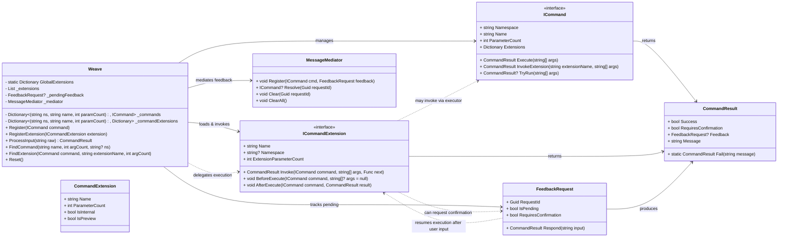

# Weave

Weave is a lightweight C# command execution engine with support for namespaces, extensions, and user feedback handling. It provides a flexible way to register commands, manage execution, and handle interactive command flows.

---

## Features

- **Command Registration:** Register commands with optional namespace and parameter support.  
- **Extensions:** Apply extensions globally or per command (e.g., `.help`, `.tryrun`).  
- **Feedback Handling:** Supports interactive user prompts and confirmation flows.  
- **Mediator Integration:** Tracks pending feedback for commands, ensuring safe resolution and cleanup.  
- **Namespace Support:** Commands and extensions can be organized per namespace for modularity.  

---

## Usage

### Registering Commands

```csharp
var weave = new Weave();

var myCommand = new MyCommand();
weave.Register(myCommand);

```
## Processing Input

```csharp
var result = weave.ProcessInput("namespace:myCommand(arg1, arg2).help");
Console.WriteLine(result.Message);
```

## Handling Feedback

If a command requires confirmation or additional input, Weave will handle it automatically:

```csharp
if (result.RequiresConfirmation)
{
    // Next user input is routed automatically to the pending feedback
    var followUp = Console.ReadLine();
    var followUpResult = weave.ProcessInput(followUp);
}

```

##UML



License

This project is licensed under the MIT License

