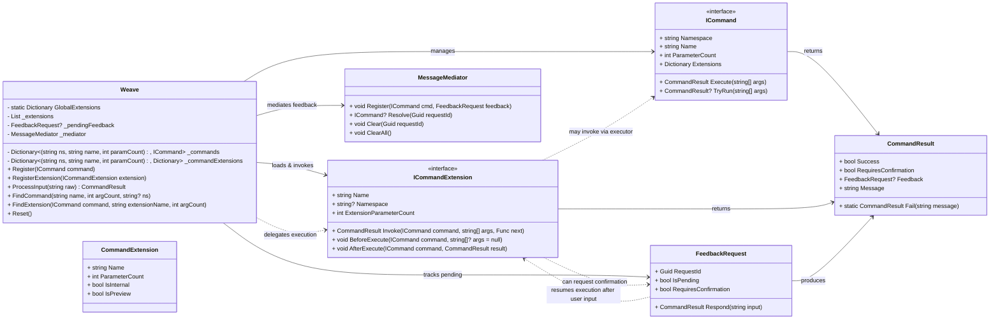

# Weave

Weave is a lightweight C# command execution engine with support for namespaces, extensions, and user feedback handling. It provides a flexible way to register commands, manage execution, and handle interactive command flows.

---

## Features

* **Command Registration:** Register commands with optional namespace and parameter support. Overload commands based on parameter count.
* **Extensions:** Apply extensions globally or per command (e.g., `.help`, `.tryrun`, `.store`).
* **Feedback Handling:** Supports interactive user prompts and confirmation flows.
* **Mediator Integration:** Tracks pending feedback for commands, ensuring safe resolution and cleanup.
* **Namespace Support:** Commands and extensions can be organized per namespace for modularity.
* **Default Storage Key:** Extensions like `store()` will use default keys (e.g., `"result"`) if no explicit target variable is provided.

---

## Usage

### Weave Script Syntax

Weave supports a simple, consistent syntax for commands and optional extensions. Commands can take zero or more parameters, and extensions can be chained after the command.

#### Basic Syntax

* `CommandName` – The name of a registered command (required).
* `param1 ... paramN` – Command parameters (optional, depending on the command).
* `.ExtensionName(...)` – Optional extension for the command. Extensions modify or enhance command behavior.

#### Examples

```csharp
// Simple command without parameters
help()

// Command with parameters
setValue("counter", 1, Wint)

// Command with an extension
setValue("counter", 1, Wint).help

// Multiple commands sequentially
setValue("score", 100)
getValue("score")
memory()
deleteValue("score")
memory()
```

### Registering Commands

```csharp
var weave = new Weave();
var myCommand = new MyCommand();
weave.Register(myCommand);
```

### Processing Input

```csharp
var result = weave.ProcessInput("namespace:myCommand(arg1, arg2).help");
Console.WriteLine(result.Message);
```

### Handling Feedback

Some commands may require confirmation or additional input. Weave handles this automatically: the command execution will internally pause and repeatedly request input until the proper response is provided.

```csharp
// Execute a command with optional namespace and extension
var result = weave.ProcessInput("namespace:myCommand(arg1, arg2).tryrun()");
Console.WriteLine(result.Message);
```

---

## Weaver Script Engine

Weaver Script Engine is a lightweight C# script execution engine built on top of the **Weave** command framework.

---

### Features

* Script Parsing: labels, commands, assignments, `if` conditions, `do...while` loops, and `goto`.
* Variable Management: type-safe registry for `Wint`, `Wdouble`, `Wbool`, and `Wstring`.
* Conditional Execution: simple expression evaluator for `if` and loop conditions.
* Looping: `do { ... } while(condition)` support.
* Goto Labels: jump between script labels.
* Feedback Handling: internal pause for interactive input or confirmation.
* Debugger-Friendly: `DebugHelpers` utility for script inspection.

---

### Evaluate Command

`evaluate()` can be used both as a calculator and registry-aware expression evaluator.

```csharp
// Simple arithmetic
evaluate("1 + 2 + 3"); // 6

// Store result in registry
evaluate("1 + 2 + 3", "total"); // stores 6 in 'total'

// Use registry variables
setValue("a", 4, Wint);
setValue("b", 6, Wint);
evaluate("a + b"); // 10

// Logical expressions
setValue("flag1", true, Wbool);
setValue("flag2", false, Wbool);
evaluate("flag1 && flag2"); // false

// Complex expressions
setValue("score1", 10, Wint);
setValue("score2", 5, Wint);
evaluate("score1 > score2 && score2 > 0"); // true
```

**Note:** If `store()` is used without a key, the result will automatically be stored under the default variable `"result"`.

---

## CoreBuilder and CoreViewer

* **CoreBuilder:** code analyzers and utilities implementing `ICommand`. Can be executed from Weave, scripted, or used in UI.
* **CoreViewer:** GUI frontend displaying analyzer output with basic interaction buttons.

**Included Modules:**
`DirectorySizeAnalyzer`, `LogTailCommand`, `HeaderExtractor`, `ResXtract`, `AllocationAnalyzer`, `DisposableAnalyzer`, etc.

---

## UML Overview



---

# Changelog / Recent Fixes

## [Unreleased]

### Improvements
- **TryRun Extension:**  
  - Updated interface and implementation to support both extensionArgs and original commandArgs.  
  - Tests refactored to simulate user confirmation (yes/no) correctly.  
  - Fixed preview message handling for commands with and without `TryRun()`.

- **Global Extensions Handling:**  
  - Corrected parameter checks for `.store()` and other global extensions.  
  - Ensured optional and variadic parameters are correctly accepted.  
  - Introduced `GlobalDirect` to prevent accidental overwriting of core extensions.

  - **Further work on the Script engine:**
   - Improved Script compilation and execution robustness.
   - Weaverprogram implemented for future integration as it's own program and future entry for DebugHelpers.

  - **Home brew Evaluator:**
   - write my owne evaluator to replace Ms own due to performance and wrong behaviour.
   - extensible design to allow future operators and functions to be added easily.
   - full test coverage for all evaluator features.

  - **Prepare complex Datatypes:**
   - In the future we might support pointers, lists and objects.

### Bug Fixes
- Fixed `FindCommand` / `FindExtension` logic to correctly delegate arguments to command and extensions.  
- Fixed `.store()` behavior to default to `result` key when no argument provided.  
- Corrected `WhoAmIExtension` to use proper argument array (`extensionArgs`) instead of missing variable.  

### Notes
- Minor interface updates were required for ICommandExtension to support multi-argument invocation.  
- Some legacy extensions were updated to comply with new interface signature.  
- Variable registry and expression evaluation robustness improved, especially for chained commands and extensions.
- work on some syntax sugar for the Script engine to make it more user friendly.

---

This project is licensed under the Apache License

