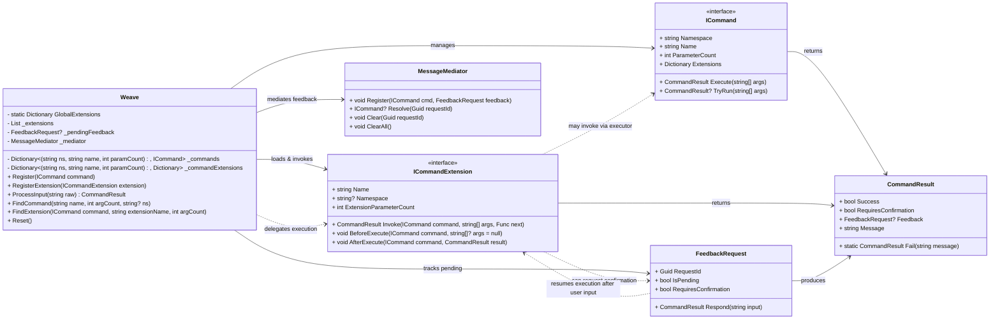

# Weave

Weave is a lightweight, highly extensible C# command execution and scripting engine. It provides a robust framework to register commands, orchestrate complex workflows, manage interactive user feedback, and dynamically expand capabilities at runtime using plugin-loaded assemblies.

---

## Features

* **Command Registration:** Register commands with optional namespaces and parameter support. Includes automatic command overloading based on parameter count.
* **Pipeline Extensions:** Apply extensions globally or per-command (e.g., `.help()`, `.tryrun()`, `.store()`, `.clean()`) to modify behavior via a middleware pipeline.
* **Interactive Feedback:** Natively supports interactive prompts, confirmation flows, and multi-stage user input without blocking the execution thread.
* **Custom Expression Evaluator:** Features a highly optimized, homebrew expression evaluator for complex math and logical conditions using the Shunting Yard algorithm (RPN).
* **Message Mediator:** Safely tracks pending feedback and delegates execution between the user, commands, and the script executor.
* **Dynamic Plugin Loading:** Extend the engine dynamically. Discover, load, and register new `ICommand` implementations from external `.dll` assemblies at runtime without recompiling.
* **Smart Storage:** Extensions like `store()` automatically fall back to default keys (e.g., `"result"`) if no explicit target variable is provided.

---

## Usage

### Weave Script Syntax

Weave uses a simple, consistent syntax for executing commands and chaining extensions. 

* `CommandName` – The registered command to execute (required).
* `param1 ... paramN` – Command parameters (optional).
* `.ExtensionName(...)` – Modifies or enhances the command's behavior (optional).

#### Examples

```csharp
// Simple command without parameters
help()

// Command with parameters
setValue("counter", 1, Wint)

// Command chained with an extension
setValue("counter", 1, Wint).help()

// Sequential execution
setValue("score", 100)
getValue("score")
memory()
deleteValue("score")
memory()
```

### Registering Commands

```csharp
var weave = new Weave();
var myCommand = new MyCommand();
weave.Register(myCommand);
```

### Processing Input

```csharp
var result = weave.ProcessInput("namespace:myCommand(arg1, arg2).help");
Console.WriteLine(result.Message);
```

### Handling Feedback

Some commands may require confirmation or additional input. Weave handles this automatically: the command execution will internally pause and repeatedly request input until the proper response is provided.

```csharp
// Execute a command with optional namespace and extension
var result = weave.ProcessInput("namespace:myCommand(arg1, arg2).tryrun()");
Console.WriteLine(result.Message);
```

---

### Loading Command Plugins

Weave supports loading external command plugins at runtime.  
Any assembly that contains types implementing `ICommand` can be loaded and registered dynamically.

This allows Weave to extend itself without recompiling the host application.

#### Load from Script

If needed, plugins can be loaded directly from Weave with the `load` command:

```csharp
load("Plugins")
load("MyCommands.dll")
```

## Weaver Script Engine

Weaver Script Engine is a lightweight C# script execution engine built on top of the **Weave** command framework.

---

### Features

* Script Parsing: labels, commands, assignments, `if` conditions, `do...while` loops, and `goto`.
* Variable Management: type-safe registry for `Wint`, `Wdouble`, `Wbool`, and `Wstring`.
* Conditional Execution: simple expression evaluator for `if` and loop conditions.
* Looping: `do { ... } while(condition)` support.
* Goto Labels: jump between script labels.
* Feedback Handling: internal pause for interactive input or confirmation.
* Debugger-Friendly: `DebugHelpers` utility for script inspection.
* Runtime Extensibility: Scripts can load external command assemblies during execution using the `load()` command, allowing scripts to extend the language dynamically.

---

### Evaluate Command

`evaluate()` can be used both as a calculator and registry-aware expression evaluator.

```csharp
// Simple arithmetic
evaluate("1 + 2 + 3"); // 6

// Store result in registry
evaluate("1 + 2 + 3", "total"); // stores 6 in 'total'

// Use registry variables
setValue("a", 4, Wint);
setValue("b", 6, Wint);
evaluate("a + b"); // 10

// Logical expressions
setValue("flag1", true, Wbool);
setValue("flag2", false, Wbool);
evaluate("flag1 && flag2"); // false

// Complex expressions
setValue("score1", 10, Wint);
setValue("score2", 5, Wint);
evaluate("score1 > score2 && score2 > 0"); // true
```

**Note:** If `store()` is used without a key, the result will automatically be stored under the default variable `"result"`.

---

## Ecosystem Tools

* **CoreBuilder:** code analyzers and utilities implementing `ICommand`. Can be executed from Weave, scripted, or used in UI.
* **CoreViewer:** GUI frontend displaying analyzer output with basic interaction buttons.

**Included Modules:**
`DirectorySizeAnalyzer`, `LogTailCommand`, `HeaderExtractor`, `ResXtract`, `AllocationAnalyzer`, `DisposableAnalyzer`, etc.

---

## UML Overview


```mermaid
classDiagram
direction LR

class Weave {
    - Dictionary<(string ns, string name, int paramCount), ICommand> _commands
    - Dictionary<(string ns, string name, int paramCount), Dictionary<string, int>> _commandExtensions
    - static Dictionary<string, CommandExtension> GlobalExtensions
    - List<ICommandExtension> _extensions
    - FeedbackRequest? _pendingFeedback
    - MessageMediator _mediator
    + Register(ICommand command)
    + RegisterExtension(ICommandExtension extension)
    + ProcessInput(string raw) CommandResult
    + FindCommand(string name, int argCount, string? ns)
    + FindExtension(ICommand command, string extensionName, int argCount)
    + Reset()
}

class ICommand {
    <<interface>>
    + string Namespace
    + string Name
    + int ParameterCount
    + Dictionary<string, int> Extensions
    + CommandResult Execute(string[] args)
    + CommandResult? TryRun(string[] args)
}

class ICommandExtension {
    <<interface>>
    + string Name
    + string? Namespace
    + int ExtensionParameterCount
    + CommandResult Invoke(ICommand command, string[] args, Func<string[], CommandResult> next)
    + void BeforeExecute(ICommand command, string[]? args = null)
    + void AfterExecute(ICommand command, CommandResult result)
}
class CommandResult {
    + bool Success
    + bool RequiresConfirmation
    + FeedbackRequest? Feedback
    + string Message
    + static CommandResult Fail(string message)
}

class FeedbackRequest {
    + Guid RequestId
    + bool IsPending
    + bool RequiresConfirmation
    + CommandResult Respond(string input)
}

class MessageMediator {
    + void Register(ICommand cmd, FeedbackRequest feedback)
    + ICommand? Resolve(Guid requestId)
    + void Clear(Guid requestId)
    + void ClearAll()
}

Weave --> ICommand : manages
Weave --> ICommandExtension : loads & invokes
Weave --> MessageMediator : mediates feedback
Weave --> FeedbackRequest : tracks pending
ICommand --> CommandResult : returns
ICommandExtension --> CommandResult : returns
FeedbackRequest --> CommandResult : produces
Weave ..> ICommandExtension : delegates execution
ICommandExtension ..> ICommand : may invoke via executor
ICommandExtension ..> FeedbackRequest : can request confirmation
FeedbackRequest ..> ICommandExtension : resumes execution after user input
```

---

# Changelog / Recent Fixes

## [Unreleased]

### Improvements

**Major Features:**  
  - Custom Homebrew Evaluator: Replaced external evaluation libraries with a high-performance, custom-built Reverse Polish Notation (RPN) engine. Fully supports complex datatypes, mathematical precedence, and logical operators natively.

  - Plugin Loader Support: Introduced a generic plugin loader for discovering implementations of arbitrary contracts. Weave can now dynamically load ICommand components from external assemblies at runtime via the load() command.

  - Advanced Memory Architecture: Prepared the Virtual Machine memory heap to support future complex datatypes (pointers, arrays/lists, and objects) efficiently.

  - Refined the way Extensions and Commands interact with the Registry and Memory via Interface. If allowed the extension can access the registry and memory directly, but it is not required. This allows for more flexible extension design and better separation of concerns.

  - Since now we use Memory, we have to clean it, for this a new global Extesion called `clean()` was added, it will clear the used memory of the specified command.

**Improvements** 
  - TryRun Extension: Updated the implementation to correctly route both extensionArgs and commandArgs. Refactored test suite to accurately simulate multi-stage user confirmation (yes/no).

  - Global Extensions: Corrected parameter checks for .store() and other global modifiers. Introduced GlobalDirect mapping to prevent accidental overrides of core extensions.

  - Script Engine Compilation: Improved AST Lowering and script compilation robustness. Bypassed artificial compile-time limits, allowing the execution pipeline to safely resolve complex variables and parentheses at runtime.

  - Weaver Program: Established Weaverprogram as an entry point for standalone script execution and integrated deep DebugHelpers.chained commands and extensions.
- work on some syntax sugar for the Script engine to make it more user friendly.

**Bug Fixes** 
  - Fixed FindCommand / FindExtension logic to guarantee precise argument delegation.

  - Fixed .store() extension to securely default to the result key when no argument is passed.

  - Patched the WhoAmIExtension to utilize the correct extensionArgs array, preventing missing variable errors.

  - Resolved thread-safety and execution synchronization issues inside the variable registry and evaluation pipeline.

---

This project is licensed under the Apache License

